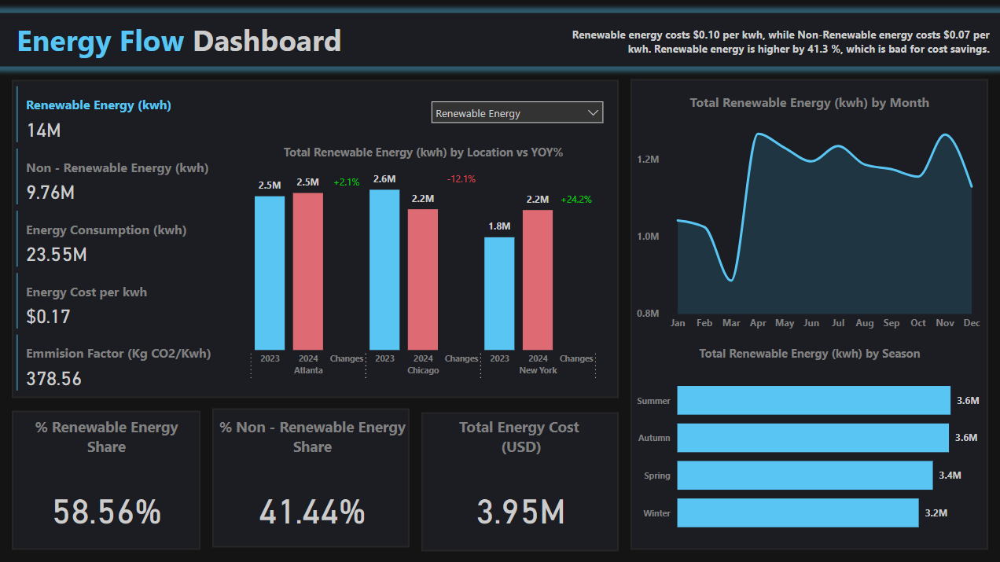
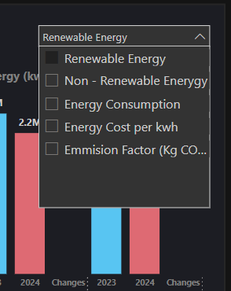

# ⚡ Energy Flow Dashboard – Power BI + DAX

## 📌 Project Description

The **Energy Flow Dashboard** is a dynamic Power BI visualization tool designed to monitor and analyze energy consumption patterns across different regions and time periods. It provides actionable insights into **renewable and non-renewable energy usage**, **cost efficiency**, **carbon emissions**, and **seasonal energy trends**, helping decision-makers promote cost savings and sustainability.

This dashboard is powered by **Microsoft Power BI** with calculated KPIs and custom measures written in **DAX**.

---

## 🧩 Features & Insights

| 💡 Feature | 🔍 Description |
|-----------|----------------|
| 🔋 **Total Energy Analysis** | Tracks total renewable (14M kWh) and non-renewable energy (9.76M kWh) usage |
| 🧮 **Cost Metrics** | Displays energy cost per kWh ($0.17) and total energy cost ($3.95M) |
| 🌱 **Carbon Footprint** | Monitors emission factor (378.56 kg CO₂/kWh) |
| 📍 **Regional Comparison** | YoY comparisons across Atlanta, Chicago, and New York |
| 📊 **Monthly & Seasonal Trends** | View energy usage patterns across months and seasons |
| 📈 **KPI Highlights** | % Renewable Energy Share (58.56%) and Non-Renewable (41.44%) |
| ⚙️ **Interactive Dropdown Filters** | Users can dynamically switch between different KPIs in the visuals |

---

## 🔀 Dynamic Filters

As seen in the image below, the dashboard includes a **custom drop-down selector** that allows users to toggle between multiple metrics. The chart updates based on the selected parameter.

**Available Metrics in the Filter:**
- ✅ Renewable Energy  
- ✅ Non-Renewable Energy  
- ✅ Energy Consumption  
- ✅ Energy Cost per kWh  
- ✅ Emission Factor (Kg CO₂/kWh)

These filters enable **on-demand comparative analysis** across different dimensions without navigating to new pages, enhancing user interaction.

---

## 🛠️ Tools & Technologies

-  **Microsoft Power BI** – Dashboard design & interactivity
-  **DAX** – Custom KPIs and calculated measures
-  **Excel** – Data source

---

## 📷 Dashboard Snapshots

### Full Dashboard  

### Filter View  

---

## 📫 Contact

**Ajay Nalagampalli**  
📧 contact.ajay.n@gmail.com  
🔗 [LinkedIn](https://www.linkedin.com/in/ajay-nalagampalli)

---

## ⭐ If you found this dashboard insightful, feel free to star the repository!

